# Flujo Frontend - Módulo de Devoluciones

Esta guía explica cómo implementar la pantalla de devoluciones en el frontend de RenTools.

## 🎯 Objetivo

Crear una pantalla donde el usuario pueda:
1. Buscar un contrato
2. Ver las herramientas arrendadas
3. Seleccionar una o varias herramientas para devolver
4. Registrar la devolución masiva en una sola transacción

## 📊 Flujo Completo

```mermaid
graph TD
    A[Usuario busca contrato] --> B[Sistema muestra resumen del contrato]
    B --> C[Usuario ve herramientas arrendadas]
    C --> D{¿Herramientas pendientes?}
    D -->|Sí| E[Usuario selecciona herramientas a devolver]
    D -->|No| F[Mostrar: Todo devuelto]
    E --> G[Para cada herramienta: cantidad, estado, observaciones]
    G --> H[Usuario hace clic en Registrar Devolución]
    H --> I[POST /devoluciones/masiva]
    I --> J{¿Exitoso?}
    J -->|Sí| K[Mostrar resumen de devolución]
    J -->|No| L[Mostrar error]
    K --> M{¿Contrato finalizado?}
    M -->|Sí| N[Mostrar mensaje: Contrato completado]
    M -->|No| O[Mostrar: Faltan X herramientas]
```



## 🚀 Implementación Paso a Paso

### Paso 1: Buscar Contrato y Obtener Resumen

**Endpoint:** `GET /devoluciones/contrato/:id_contrato/resumen`

```typescript
// 1. Usuario ingresa ID del contrato o busca por cliente
const contratoId = 1;

// 2. Obtener resumen del contrato
const resumen = await fetch(
  `${API_URL}/devoluciones/contrato/${contratoId}/resumen`,
  {
    headers: {
      'Authorization': `Bearer ${token}`
    }
  }
).then(res => res.json());

console.log(resumen);
```

**Respuesta:**
```json
{
  "contrato": {
    "id_contrato": 1,
    "estado": "activo",
    "monto_estimado": 250000,
    "monto_cobrado_hasta_ahora": 120000
  },
  "herramientas": [
    {
      "id_detalle": 1,
      "nombre_herramienta": "Taladro Bosch",
      "cantidad_contratada": 2,
      "cantidad_devuelta": 0,
      "cantidad_pendiente": 2,
      "estado_devolucion": "pendiente"
    },
    {
      "id_detalle": 2,
      "nombre_herramienta": "Escalera Aluminio",
      "cantidad_contratada": 3,
      "cantidad_devuelta": 1,
      "cantidad_pendiente": 2,
      "estado_devolucion": "parcial",
      "monto_cobrado": 40000
    }
  ],
  "resumen": {
    "total_herramientas": 5,
    "total_devueltas": 1,
    "total_pendientes": 4,
    "porcentaje_devuelto": 20.0
  }
}
```

### Paso 2: Interfaz de Usuario

#### Diseño Recomendado

```
┌─────────────────────────────────────────────────────────┐
│  📦 DEVOLUCIÓN DE HERRAMIENTAS - Contrato #1           │
├─────────────────────────────────────────────────────────┤
│                                                          │
│  Cliente: Juan Pérez                                     │
│  Estado: Activo                                          │
│  Progreso: [████░░░░░░] 20% devuelto                    │
│                                                          │
├─────────────────────────────────────────────────────────┤
│  HERRAMIENTAS PENDIENTES DE DEVOLUCIÓN                   │
├─────────────────────────────────────────────────────────┤
│                                                          │
│  ☐ Taladro Bosch                                        │
│     Contratadas: 2 | Devueltas: 0 | Pendientes: 2      │
│     ┌─────────────────────────────────────────────┐    │
│     │ Cantidad a devolver: [_2_] (slider 0-2)    │    │
│     │ Estado: [Buen estado ▼]                     │    │
│     │ Observaciones: [________________]           │    │
│     └─────────────────────────────────────────────┘    │
│                                                          │
│  ☑ Escalera Aluminio                                    │
│     Contratadas: 3 | Devueltas: 1 | Pendientes: 2      │
│     ┌─────────────────────────────────────────────┐    │
│     │ Cantidad a devolver: [_2_] (slider 0-2)    │    │
│     │ Estado: [Reparación menor ▼]                │    │
│     │ Observaciones: [Peldaño flojo_______]       │    │
│     └─────────────────────────────────────────────┘    │
│                                                          │
├─────────────────────────────────────────────────────────┤
│  RESUMEN                                                 │
│  Herramientas seleccionadas: 2                          │
│  Total a devolver: 4 unidades                           │
│                                                          │
│  [ Cancelar ]              [ Registrar Devolución ]     │
└─────────────────────────────────────────────────────────┘
```

### Paso 3: Estado del Componente (React/Vue)

```typescript
interface HerramientaParaDevolver {
  id_detalle: number;
  nombre_herramienta: string;
  cantidad_contratada: number;
  cantidad_devuelta: number;
  cantidad_pendiente: number;
  // Para el formulario:
  seleccionada: boolean;
  cantidad_a_devolver: number;
  estado: 'buen_estado' | 'danada' | 'reparacion_menor';
  observaciones: string;
}

interface EstadoDevolucion {
  contratoId: number;
  herramientas: HerramientaParaDevolver[];
  fechaDevolucion: string;
  loading: boolean;
}
```

### Paso 4: Registrar Devolución Masiva

**Endpoint:** `POST /devoluciones/masiva`

```typescript
// Preparar el payload
const herramientasSeleccionadas = herramientas.filter(h => h.seleccionada);

const payload = {
  devoluciones: herramientasSeleccionadas.map(h => ({
    id_detalle: h.id_detalle,
    cantidad_devuelta: h.cantidad_a_devolver,
    fecha_devolucion: fechaDevolucion, // "2024-12-05"
    estado: h.estado,
    observaciones: h.observaciones || undefined
  }))
};

// Enviar request
const response = await fetch(`${API_URL}/devoluciones/masiva`, {
  method: 'POST',
  headers: {
    'Authorization': `Bearer ${token}`,
    'Content-Type': 'application/json'
  },
  body: JSON.stringify(payload)
});

const resultado = await response.json();
console.log(resultado);
```

**Request Body:**
```json
{
  "devoluciones": [
    {
      "id_detalle": 1,
      "cantidad_devuelta": 2,
      "fecha_devolucion": "2024-12-05",
      "estado": "buen_estado"
    },
    {
      "id_detalle": 2,
      "cantidad_devuelta": 2,
      "fecha_devolucion": "2024-12-05",
      "estado": "reparacion_menor",
      "observaciones": "Escalera con peldaño flojo"
    }
  ]
}
```

**Response:**
```json
{
  "devoluciones": [
    {
      "id_devolucion": 1,
      "id_detalle": 1,
      "cantidad_devuelta": 2,
      "dias_reales": 5,
      "monto_cobrado": 50000,
      "estado": "buen_estado",
      "detalle": {
        "nombre_herramienta": "Taladro Bosch",
        "contrato": {
          "id_contrato": 1,
          "estado": "finalizado"
        }
      }
    },
    {
      "id_devolucion": 2,
      "id_detalle": 2,
      "cantidad_devuelta": 2,
      "dias_reales": 5,
      "monto_cobrado": 30000,
      "estado": "reparacion_menor",
      "observaciones": "Escalera con peldaño flojo",
      "detalle": {
        "nombre_herramienta": "Escalera Aluminio",
        "contrato": {
          "id_contrato": 1,
          "estado": "finalizado"
        }
      }
    }
  ],
  "resumen": {
    "total_devoluciones": 2,
    "total_herramientas_devueltas": 4,
    "monto_total_cobrado": 80000,
    "contratos_finalizados": [1]
  }
}
```

### Paso 5: Mostrar Resultado

```typescript
// Después de la devolución exitosa
if (resultado.resumen.contratos_finalizados.length > 0) {
  // 🎉 El contrato se finalizó automáticamente
  showSuccess(
    `¡Devolución exitosa! El contrato #${contratoId} ha sido finalizado.
     Monto total cobrado: $${resultado.resumen.monto_total_cobrado.toLocaleString()}`
  );
} else {
  // ✅ Devolución parcial exitosa
  showSuccess(
    `¡Devolución registrada! Se devolvieron ${resultado.resumen.total_herramientas_devueltas} herramientas.
     Monto cobrado: $${resultado.resumen.monto_total_cobrado.toLocaleString()}`
  );

  // Actualizar resumen para ver qué falta
  await actualizarResumen();
}
```

## 💻 Código Completo - React + TypeScript

```typescript
import React, { useState, useEffect } from 'react';

interface Herramienta {
  id_detalle: number;
  nombre_herramienta: string;
  cantidad_contratada: number;
  cantidad_devuelta: number;
  cantidad_pendiente: number;
  estado_devolucion: string;
  // Para el formulario
  seleccionada?: boolean;
  cantidad_a_devolver?: number;
  estado?: 'buen_estado' | 'danada' | 'reparacion_menor';
  observaciones?: string;
}

interface ResumenContrato {
  contrato: {
    id_contrato: number;
    estado: string;
    monto_estimado: number;
    monto_cobrado_hasta_ahora: number;
  };
  herramientas: Herramienta[];
  resumen: {
    total_herramientas: number;
    total_devueltas: number;
    total_pendientes: number;
    porcentaje_devuelto: number;
  };
}

export default function DevolucionScreen({ contratoId }: { contratoId: number }) {
  const [resumen, setResumen] = useState<ResumenContrato | null>(null);
  const [herramientas, setHerramientas] = useState<Herramienta[]>([]);
  const [fechaDevolucion, setFechaDevolucion] = useState(
    new Date().toISOString().split('T')[0]
  );
  const [loading, setLoading] = useState(false);

  // 1. Cargar resumen del contrato
  useEffect(() => {
    cargarResumen();
  }, [contratoId]);

  const cargarResumen = async () => {
    const response = await fetch(
      `/api/devoluciones/contrato/${contratoId}/resumen`,
      {
        headers: { 'Authorization': `Bearer ${localStorage.getItem('token')}` }
      }
    );
    const data = await response.json();
    setResumen(data);

    // Inicializar herramientas con valores por defecto
    setHerramientas(
      data.herramientas
        .filter((h: Herramienta) => h.cantidad_pendiente > 0)
        .map((h: Herramienta) => ({
          ...h,
          seleccionada: false,
          cantidad_a_devolver: h.cantidad_pendiente,
          estado: 'buen_estado',
          observaciones: ''
        }))
    );
  };

  // 2. Manejar selección de herramienta
  const toggleHerramienta = (id_detalle: number) => {
    setHerramientas(prev =>
      prev.map(h =>
        h.id_detalle === id_detalle
          ? { ...h, seleccionada: !h.seleccionada }
          : h
      )
    );
  };

  // 3. Actualizar cantidad a devolver
  const actualizarCantidad = (id_detalle: number, cantidad: number) => {
    setHerramientas(prev =>
      prev.map(h =>
        h.id_detalle === id_detalle
          ? { ...h, cantidad_a_devolver: cantidad }
          : h
      )
    );
  };

  // 4. Actualizar estado
  const actualizarEstado = (
    id_detalle: number,
    estado: 'buen_estado' | 'danada' | 'reparacion_menor'
  ) => {
    setHerramientas(prev =>
      prev.map(h =>
        h.id_detalle === id_detalle ? { ...h, estado } : h
      )
    );
  };

  // 5. Actualizar observaciones
  const actualizarObservaciones = (id_detalle: number, observaciones: string) => {
    setHerramientas(prev =>
      prev.map(h =>
        h.id_detalle === id_detalle ? { ...h, observaciones } : h
      )
    );
  };

  // 6. Registrar devolución masiva
  const registrarDevolucion = async () => {
    const seleccionadas = herramientas.filter(h => h.seleccionada);

    if (seleccionadas.length === 0) {
      alert('Debes seleccionar al menos una herramienta');
      return;
    }

    setLoading(true);

    try {
      const payload = {
        devoluciones: seleccionadas.map(h => ({
          id_detalle: h.id_detalle,
          cantidad_devuelta: h.cantidad_a_devolver!,
          fecha_devolucion: fechaDevolucion,
          estado: h.estado!,
          observaciones: h.observaciones || undefined
        }))
      };

      const response = await fetch('/api/devoluciones/masiva', {
        method: 'POST',
        headers: {
          'Authorization': `Bearer ${localStorage.getItem('token')}`,
          'Content-Type': 'application/json'
        },
        body: JSON.stringify(payload)
      });

      if (!response.ok) throw new Error('Error al registrar devolución');

      const resultado = await response.json();

      // Mostrar resultado
      if (resultado.resumen.contratos_finalizados.length > 0) {
        alert(
          `¡Contrato finalizado! 🎉\n` +
          `Se devolvieron ${resultado.resumen.total_herramientas_devueltas} herramientas.\n` +
          `Monto total: $${resultado.resumen.monto_total_cobrado.toLocaleString()}`
        );
      } else {
        alert(
          `¡Devolución exitosa! ✅\n` +
          `Se devolvieron ${resultado.resumen.total_herramientas_devueltas} herramientas.\n` +
          `Monto: $${resultado.resumen.monto_total_cobrado.toLocaleString()}`
        );
      }

      // Recargar resumen
      await cargarResumen();
    } catch (error) {
      alert('Error al registrar devolución: ' + error);
    } finally {
      setLoading(false);
    }
  };

  if (!resumen) return <div>Cargando...</div>;

  return (
    <div className="devolucion-container">
      <h1>Devolución de Herramientas - Contrato #{contratoId}</h1>

      {/* Resumen del contrato */}
      <div className="resumen-contrato">
        <p>Estado: {resumen.contrato.estado}</p>
        <p>Progreso: {resumen.resumen.porcentaje_devuelto}% devuelto</p>
        <progress value={resumen.resumen.porcentaje_devuelto} max={100} />
      </div>

      {/* Lista de herramientas */}
      <div className="herramientas-list">
        <h2>Herramientas Pendientes de Devolución</h2>

        {herramientas.map(h => (
          <div key={h.id_detalle} className="herramienta-item">
            <label>
              <input
                type="checkbox"
                checked={h.seleccionada}
                onChange={() => toggleHerramienta(h.id_detalle)}
              />
              <strong>{h.nombre_herramienta}</strong>
            </label>

            <p>
              Contratadas: {h.cantidad_contratada} |
              Devueltas: {h.cantidad_devuelta} |
              Pendientes: {h.cantidad_pendiente}
            </p>

            {h.seleccionada && (
              <div className="form-devolucion">
                {/* Cantidad */}
                <label>
                  Cantidad a devolver:
                  <input
                    type="range"
                    min="1"
                    max={h.cantidad_pendiente}
                    value={h.cantidad_a_devolver}
                    onChange={e =>
                      actualizarCantidad(h.id_detalle, parseInt(e.target.value))
                    }
                  />
                  <span>{h.cantidad_a_devolver}</span>
                </label>

                {/* Estado */}
                <label>
                  Estado:
                  <select
                    value={h.estado}
                    onChange={e =>
                      actualizarEstado(
                        h.id_detalle,
                        e.target.value as any
                      )
                    }
                  >
                    <option value="buen_estado">Buen estado</option>
                    <option value="reparacion_menor">Reparación menor</option>
                    <option value="danada">Dañada</option>
                  </select>
                </label>

                {/* Observaciones */}
                <label>
                  Observaciones:
                  <textarea
                    value={h.observaciones}
                    onChange={e =>
                      actualizarObservaciones(h.id_detalle, e.target.value)
                    }
                    placeholder="Detalles opcionales..."
                  />
                </label>
              </div>
            )}
          </div>
        ))}
      </div>

      {/* Fecha de devolución */}
      <div className="fecha-devolucion">
        <label>
          Fecha de devolución:
          <input
            type="date"
            value={fechaDevolucion}
            onChange={e => setFechaDevolucion(e.target.value)}
          />
        </label>
      </div>

      {/* Botones */}
      <div className="acciones">
        <button onClick={() => window.history.back()}>
          Cancelar
        </button>
        <button
          onClick={registrarDevolucion}
          disabled={loading || !herramientas.some(h => h.seleccionada)}
        >
          {loading ? 'Procesando...' : 'Registrar Devolución'}
        </button>
      </div>
    </div>
  );
}
```

## 🎨 Estilos CSS Recomendados

```css
.devolucion-container {
  max-width: 800px;
  margin: 0 auto;
  padding: 20px;
}

.resumen-contrato {
  background: #f5f5f5;
  padding: 15px;
  border-radius: 8px;
  margin-bottom: 20px;
}

.resumen-contrato progress {
  width: 100%;
  height: 30px;
}

.herramientas-list {
  margin: 20px 0;
}

.herramienta-item {
  border: 1px solid #ddd;
  padding: 15px;
  margin-bottom: 10px;
  border-radius: 8px;
}

.herramienta-item label {
  display: flex;
  align-items: center;
  gap: 10px;
  cursor: pointer;
}

.form-devolucion {
  margin-top: 15px;
  padding: 15px;
  background: #f9f9f9;
  border-radius: 4px;
}

.form-devolucion label {
  display: block;
  margin-bottom: 10px;
}

.form-devolucion input[type="range"] {
  width: 200px;
  margin: 0 10px;
}

.form-devolucion select,
.form-devolucion textarea {
  width: 100%;
  padding: 8px;
  margin-top: 5px;
  border: 1px solid #ddd;
  border-radius: 4px;
}

.acciones {
  display: flex;
  gap: 10px;
  justify-content: flex-end;
  margin-top: 20px;
}

.acciones button {
  padding: 10px 20px;
  font-size: 16px;
  border: none;
  border-radius: 4px;
  cursor: pointer;
}

.acciones button:first-child {
  background: #6c757d;
  color: white;
}

.acciones button:last-child {
  background: #007bff;
  color: white;
}

.acciones button:disabled {
  background: #ccc;
  cursor: not-allowed;
}
```

## 🔄 Flujo Alternativo: Devolución Individual

Si prefieres permitir devoluciones una por una (sin el endpoint masivo):

```typescript
// Usar el endpoint normal para cada herramienta
for (const herramienta of herramientasSeleccionadas) {
  await fetch('/api/devoluciones', {
    method: 'POST',
    headers: {
      'Authorization': `Bearer ${token}`,
      'Content-Type': 'application/json'
    },
    body: JSON.stringify({
      id_detalle: herramienta.id_detalle,
      cantidad_devuelta: herramienta.cantidad_a_devolver,
      fecha_devolucion: fechaDevolucion,
      estado: herramienta.estado,
      observaciones: herramienta.observaciones
    })
  });
}
```

**⚠️ Problema:** No es atómico, si una falla, las anteriores ya se procesaron.

**✅ Solución:** Usar el endpoint masivo `/devoluciones/masiva`

## 📱 Consideraciones Móviles

Para dispositivos móviles, considera:

1. **Usar acordeones** para mostrar/ocultar detalles de cada herramienta
2. **Botones grandes** para facilitar la interacción táctil
3. **Validación en tiempo real** con mensajes claros
4. **Confirmación antes de enviar** con resumen de lo que se va a devolver

## 🚨 Manejo de Errores

```typescript
try {
  const response = await fetch('/api/devoluciones/masiva', { ... });

  if (!response.ok) {
    const error = await response.json();
    throw new Error(error.message);
  }

  // Procesar respuesta exitosa...
} catch (error) {
  if (error.message.includes('cantidad')) {
    alert('Error: Estás intentando devolver más herramientas de las disponibles');
  } else if (error.message.includes('contrato')) {
    alert('Error: El contrato no permite devoluciones en su estado actual');
  } else {
    alert('Error al procesar la devolución: ' + error.message);
  }
}
```

## 📊 Métricas y Seguimiento

Después de cada devolución exitosa, puedes:

1. Actualizar dashboard con el nuevo estado
2. Notificar al cliente (email/SMS)
3. Generar reporte de devolución
4. Actualizar inventario en tiempo real
5. Registrar en log de auditoría

## ✅ Checklist de Implementación

- [ ] Componente de búsqueda de contrato
- [ ] Vista de resumen del contrato
- [ ] Lista de herramientas con checkboxes
- [ ] Formulario por herramienta (cantidad, estado, observaciones)
- [ ] Validación de cantidades
- [ ] Selector de fecha de devolución
- [ ] Botón de registrar devolución
- [ ] Llamada al endpoint `/devoluciones/masiva`
- [ ] Manejo de errores
- [ ] Mostrar resultado exitoso
- [ ] Actualizar vista después de la devolución
- [ ] Mostrar mensaje si el contrato se finalizó
- [ ] Diseño responsive
- [ ] Tests unitarios
- [ ] Tests de integración

¡Con esto tienes todo lo necesario para implementar la pantalla de devoluciones en tu frontend! 🚀
